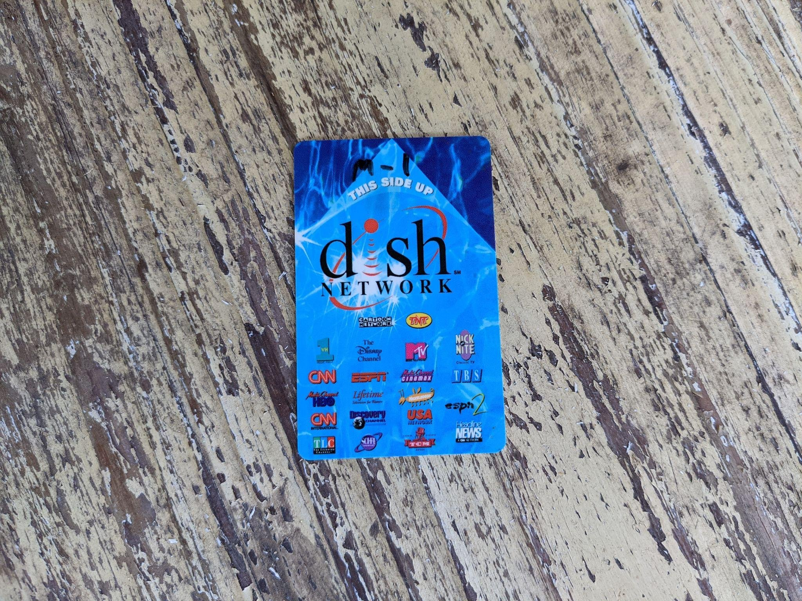

Howdy y'all,

This package is a tool for ancient Dish Network and Nagra smart cards.
On ROM3 Revision 272 and earlier, it uses a memory corruption exploit
to dump most regions of memory, such as the EEPROM.

It uses a standard USB smart card reader through the PCSC library,
using [go-card](https://github.com/sf1/go-card) as an abstraction
library.

A billion thanks are due to Chris Gerlinsky, who introduced me to this
bug over beers in Montréal.  Without his storytelling or his generous
sharing of documentation, I never would have gotten this working.

--Travis Goodspeeed


## Vulnerable Cards

Dish Network patched this vulnerability more than twenty years ago, so
you'll need to find a card which either never got the patch or has already
been hacked to disable the fix.

The cards look like this, and running `nippertool` without parameters
should show a ROM of `DNASP003` and a revision shortly after 269.
DNASP002 cards are also vulnerable, but will require a different exploit.



## Building

After installing PCSC and its daemon, just run `go build` to produce
an executable.  I only tested this on Linux, but it ought to also work
on Windows.

## Usage

```
dell% ./nippertool -help
Usage of ./nippertool:
  -dumpall string
        Downloads all of memory to a .bin file.  (Will fail.)
  -dumpeeprom string
        Downloads EEPROM from $E000 to a .bin file.
  -dumpram string
        Downloads SRAM from $0020 to a .bin file.
  -dumprand string
        Downloads RNG samples to a .bin file.
  -dumprom string
        Downloads User ROM from $4000 to a .bin file.
  -dumpsysrom string
        Downloads System ROM from $2000 to a .bin file. (Will fail.)
  -peek int
        Prints a block from a hex address. (default -1)
  -progress
        Interactive progress meter. (default true)
  -verbose
        Verbose output for debugging.
dell% ./nippertool 
Nippertool by Travis Goodspeed
A Tool for Antique Smart Cards

ROM:    DNASP003
Rev:    Rev369
Serial: 5613611
dell% 
```


## Debugging

Smart card readers like to hop between data rates.  You can run PCSCd
in the foreground with APDU logging to get a little extra visibility
into the process.

```
sudo killall pcscd
sudo pcscd --foreground -a
```

Remember that PCSCd requires the reply to have a proper header and
checksum.  If your reply is malformed, it might not appear in the log
at all.

## How the Exploit works

ROM3 Rev272 and earlier are missing a check on the length of a smart
card transaction.  Some tampered cards will report a later revision,
but do not include the patch that closes the vulnerability.

The transaction buffer is the very last 100 bytes of SRAM.
SRAM is mirrored, so it exists at `0x0020`, `0x0220`, `0x0420` and
many other locations.  When the buffer runs past the end of SRAM,
the data continues to overwrite the global variables, eventually
overwriting the buffer's index to then jump to overwriting the call
stack.  A return pointer callstack is then overwritten with `0x0060`,
the entry point of our shellcode.

My shellcode looks roughly like this, in 68HC05 machine language:

```
//This is the entry point for our shellcode.
0x9d, 0x9d, 0x9d, 0x9d, //NOPs

//Data begins at 0x19C+2.
0xAE, 0x21, //LD X, 0x20 ;
0x9d, 0x9d, //NOPs
//loop:
0xD6, 0xFF, 0xFF, //LD A, (target+1,X)  //Load the byte from the source buffer.
0xD7, 0x01, 0xA1, //STA (0x019C+1,X)  //Store the byte to the data buffer.
0x5A,       //DEC X
0x2A, 0xF6, //JRPL loop

//NOPs to keep alignment.
0x9d,

//Sends some data from the IO buffer.
0xa6, 0x93, //LDA #$93, response code
0xae, 0x40, //LDX #$17, length in data bytes
0xCD, 0x75, 0x7F, //JMP RESPONDAX to send the response.

//These three bytes will be clobbered.  Don't rely on them.
0x00, 0x00, 0x00,
//These bytes set the entry point of 0x0060
0x00, 0x00, 0x00, 0x60,
```

I haven't yet managed to patch this shellcode for clean continuation,
so instead I reboot the card between transactions.

My attack string is based upon the famous Nipper Clauz exploit, which
you can find in Echostar v. NDS as [Plaintiff's Exhibit
511A](http://www.murdochspirates.com/Pirates/Echostar/court/exhibits/TEX0511A.pdf).
Where the original shellcode disabled interrupts to dump all of EEPROM
out the serial port, my shellcode returns 32 bytes from an arbitrary
start address in a properly formatted PCSC transaction.

Two more exploits for this bug are available in the Headend Project
Report, [Plaintiff's Exhibit
98](http://www.murdochspirates.com/Pirates/Echostar/court/exhibits/TEX0098.pdf).
This internal report by David Mordinson at NDS is excellent writing,
and you'd do well to print and study it.  I chose to fork the Nipper
Clauz exploit instead of those in the Headend Report because I wanted
to re-use the ROM's own transmit function.  The Headend exploits place
their shellcode at the beginning of this buffer, preventing its reuse
for transmission.


## Limitations on System ROM Access

My tool can dump registers, SRAM, User ROM, and EEPROM, but the
ST16CF54 has a memory firewall that prevents code in SRAM from reading
code in the System ROM at 0x2000.  Code in System ROM can read itself,
and I'm able to call that code, but the 68HC05 machine language and
its 8-bit Accumulator and Index registers do not easily express ROP
gadgets that would fetch an arbitrary 16-bit pointer.

## Port to ROM2

This exploit is for ROM3 revisions up to 272.  ROM2 cards contain the
same bug, but the ROMs are quite different and shellcode would need to
be unique to each ROM.

## Random Numbers

The ST16CF54 contains a 16-bit hardware random number generator.
Dumping a few megabytes of these RNG values shows that the values are
not very random, most likely an LFSR run at a slightly different clock
rate from the CPU.

I don't see much of use of this in Nagra's ROM, but it's possible that
it could be used to exploit another smart card based upon the same
ST16 chip.

